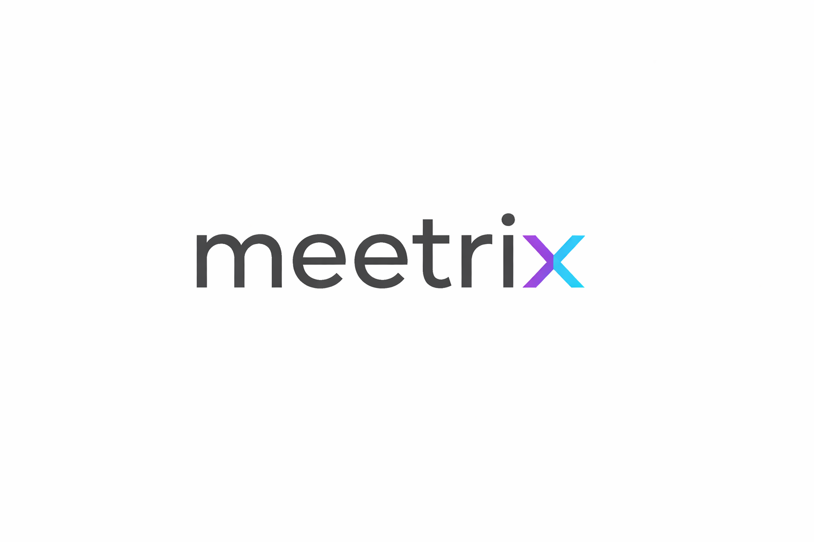

<p align="center">
  
</p>

# 🎓 Meetrix - Your Virtual Classroom

Meetrix is a modern, beautifully designed, and open-source virtual classroom platform built for educators and students. It streamlines class management, resource sharing, and live teaching into a single, effortless experience.


---

## ✨ Features

- **🏫 Virtual Classrooms**: Create or join classes in seconds with unique invite codes.
- **📂 Resource Hub**: Organized sharing of notes, slides, PDFs, and links.
- **📝 Smart Assignments**: Set deadlines and collect student submissions seamlessly.
- **🎥 One-Click Live Classes**: Instant HD video sessions (powered by Jitsi) with no downloads required.
- **💬 Class Chat**: Real-time communication for every classroom.
- **🛡️ Role-Based Access**: Specialized interfaces for students, teachers, and admins.

---

## 🛠️ Tech Stack

### Frontend
- **Framework**: [Next.js 15](https://nextjs.org/) (App Router)
- **Styling**: [Tailwind CSS 4](https://tailwindcss.com/), [Framer Motion](https://www.framer.com/motion/)
- **State Management**: [Zustand](https://github.com/pmndrs/zustand), [React Query](https://tanstack.com/query/latest)
- **Icons**: [Lucide React](https://lucide.dev/)
- **UI Components**: [Radix UI](https://www.radix-ui.com/), [Shadcn UI](https://ui.shadcn.com/)

### Backend
- **Runtime**: [Node.js](https://nodejs.org/)
- **Framework**: [Express.js](https://expressjs.com/)
- **Database (ORM)**: [Prisma](https://www.prisma.io/)
- **Real-time**: [Socket.io](https://socket.io/)
- **Authentication**: JWT, Google OAuth
- **Validation**: [Zod](https://zod.dev/)

---

## 🚀 Getting Started

### Prerequisites
- Node.js (v18+)
- PostgreSQL (or any Prisma-supported database)
- Google Cloud Console Project (for OAuth)

### Installation

1.  **Clone the repository**:
    ```bash
    git clone https://github.com/your-username/meetrix.git
    cd meetrix
    ```

2.  **Install dependencies**:
    ```bash
    npm install
    ```

3.  **Environment Setup**:
    - Copy `.env.example` to `.env` in both `apps/web` and `backend` directories.
    - Fill in the required credentials (DB URL, JWT Secret, Google Client IDs).

4.  **Database Migration**:
    ```bash
    cd backend
    npm run db:push
    ```

5.  **Run Dev Server**:
    From the root directory:
    ```bash
    npm run dev
    ```
    - **Web App**: http://localhost:3000
    - **Backend**: http://localhost:5000 (default)

---

## 📂 Project Structure

Meetrix uses a monorepo structure managed by **TurboRepo**:

- `apps/web`: Next.js frontend application.
- `backend`: Express.js backend API.
- `packages/types`: Shared TypeScript definitions.
- `packages/utils`: Shared utility functions.

---

## 🤝 Contributing

We welcome contributions! Please feel free to submit a Pull Request or open an Issue.

## 📄 License

This project is open-source and released under the **MIT License**.

---

<p align="center">
  Built with ❤️ by the Meetrix Team
</p>
