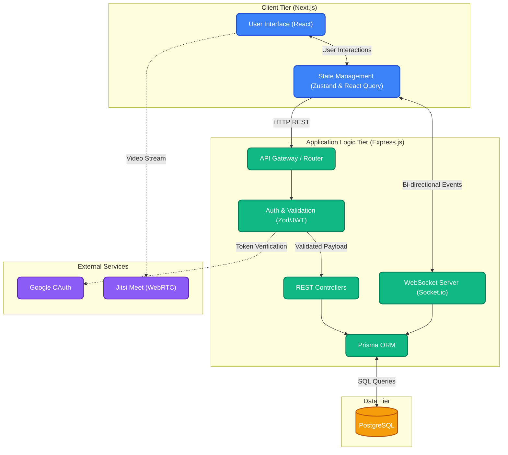
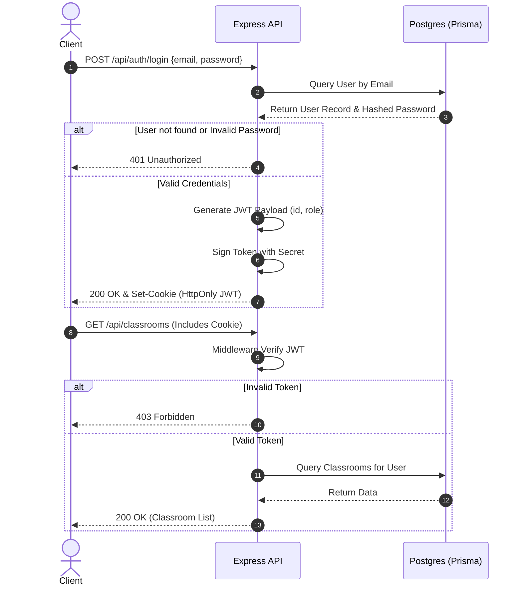
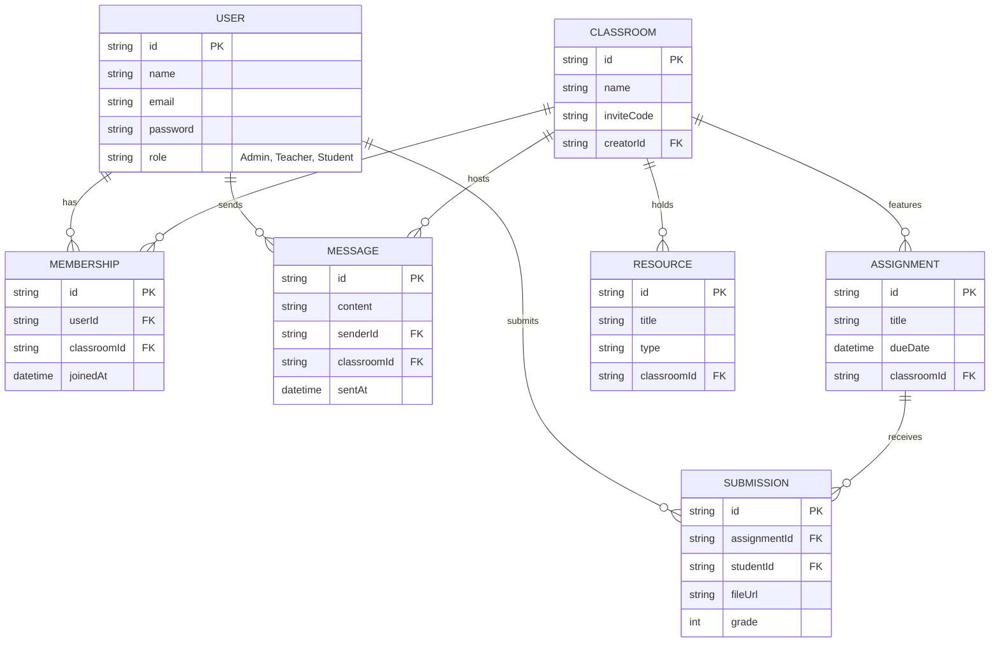

# Comprehensive Project Report: Meetrix - A Modern Virtual Classroom Platform

## 1. Executive Summary
Meetrix is a state-of-the-art, open-source virtual classroom platform engineered to bridge the growing divide between educators and students in digital environments. As the demand for robust, reliable, and user-centric online education tools has surged, Meetrix emerges as a unified solution. It consolidates class administration, resource dissemination, assignment lifecycle tracking, and interactive live teaching into a single, cohesive, and aesthetically pleasing web application. By leveraging a modern JavaScript/TypeScript stack, Meetrix ensures high performance, real-time interactivity, and a seamless user experience across varied devices.

## 2. Introduction & Problem Statement
### 2.1 Background
The rapid transition to online and hybrid learning models has exposed significant flaws in existing educational infrastructure. Educators frequently juggle multiple disparate tools—one for video conferencing, another for assignment tracking, and yet another for sharing resources. This fragmentation leads to a steep learning curve, cognitive overload, and a disjointed experience for both students and teachers.
### 2.2 Problem Statement
Current solutions often lack real-time synchronization, possess outdated user interfaces, or require extensive native applications to function effectively. There is a critical need for a unified, browser-native platform that integrates all essential classroom functionalities without compromising on performance or design.
### 2.3 Proposed Solution
Meetrix solves these issues by providing a centralized web-based platform. Built with cutting-edge web technologies like Next.js, Express, Prisma, and WebSockets, Meetrix delivers instantaneous updates, seamless navigation, and an intuitive user interface, eliminating the need for context switching among different applications.

## 3. Project Objectives & Scope
### 3.1 Primary Objectives
- **Centralized Education Hub:** To create a single platform where all educational activities (lectures, assignments, resources) are housed.
- **Frictionless Onboarding:** Simplify the process of creating and joining virtual classrooms via secure, unique invite codes.
- **Real-Time Collaboration:** Facilitate instant communication through integrated chat systems and real-time notifications.
- **High-Fidelity Live Sessions:** Embed high-definition, browser-native video conferencing without requiring external software downloads.
- **Automated Workflow Management:** Streamline the assignment creation, submission, and evaluation lifecycle.

### 3.2 Scope of the Project
The scope encompasses the design, development, and deployment of a full-stack web application featuring role-based access control (RBAC) for Admins, Teachers, and Students. It covers everything from the database schema design to the frontend user interface, including integration with third-party OAuth providers and real-time socket servers.

## 4. System Architecture
Meetrix employs a robust, scalable, and modular architectural design, utilizing a monorepo strategy to manage both frontend and backend codebases concurrently.

### 4.1 High-Level Architecture
The system is divided into three primary logical tiers:
1. **Presentation Tier (Frontend):** A Next.js-powered React application responsible for rendering the UI, handling user interactions, and maintaining client-side state.
2. **Application Logic Tier (Backend API):** An Express.js Node server that exposes RESTful endpoints, handles business logic, validates payloads, and manages real-time WebSocket connections.
3. **Data Tier (Database):** A PostgreSQL relational database managed via Prisma ORM for structured, persistent data storage.

### 4.2 Monorepo Structure
Managed by **TurboRepo**, the project is structured to maximize code reuse and streamline build processes.

| Directory Name | Role / Description | Core Technologies |
| :--- | :--- | :--- |
| `apps/web` | The primary client-facing Next.js application. | Next.js 15, React, Tailwind CSS |
| `backend` | The core server providing API routes and WebSocket connections. | Node.js, Express.js, Socket.io |
| `packages/types` | Shared TypeScript interfaces and DTOs. | TypeScript |
| `packages/utils` | Common utility functions and helpers used across the stack. | JavaScript/TypeScript |

### 4.3 Data Flow Mechanism
1. **Client Request:** The Next.js client dispatches an HTTP request or emits a WebSocket event.
2. **Gateway/Router:** The Express backend receives the request and routes it to the appropriate controller.
3. **Validation & Auth:** The request is verified for a valid JWT token. Payloads are validated against Zod schemas.
4. **Business Logic & ORM:** The controller processes the logic and queries the PostgreSQL database using Prisma.
5. **Response:** The data is serialized and returned to the client, triggering UI state updates via React Query or Zustand.

### 4.4 Architecture Flow Diagram
The following interactive flow diagram illustrates the data flow and communication protocols between the different tiers of the Meetrix platform:

## 5. Detailed Technology Stack
Meetrix is built upon a rigorously selected stack of modern web technologies to ensure longevity, type safety, and optimal performance.

### 5.1 Frontend Ecosystem
- **Next.js 15 (App Router):** Chosen for its advanced routing capabilities, Server Components, and seamless Server-Side Rendering (SSR). It ensures SEO optimization and fast initial page loads.
- **React (v18/v19):** The foundational library for building interactive, component-based user interfaces.
- **Tailwind CSS 4:** A highly customizable utility-first CSS framework that allows for rapid, consistent styling without leaving the HTML/JSX files.
- **Framer Motion:** An animation library for React that powers complex, physics-based micro-interactions and page transitions, ensuring the application feels premium and dynamic.
- **Zustand:** Employed for localized, lightweight global state management (e.g., UI toggles, active themes).
- **React Query (TanStack Query):** Manages asynchronous server state, caching, background refetching, and pagination, significantly reducing manual state boilerplate.
- **Radix UI & Shadcn UI:** Provides headless, fully accessible (a11y) UI primitives that are styled using Tailwind, ensuring components like Modals, Dropdowns, and Selects are robust.
- **Lucide React:** A consistent, clean iconography library.

### 5.2 Backend Ecosystem
- **Node.js:** The JavaScript runtime that allows for high-concurrency, event-driven server programming.
- **Express.js:** A minimalist web framework providing a robust set of features for web and mobile applications, acting as the routing layer for the REST API.
- **Socket.io:** A library that enables low-latency, bidirectional, and event-based communication between the web clients and the server, crucial for the chat and notification systems.

### 5.3 Database & ORM
- **Prisma ORM:** A modern database toolkit that generates type-safe database access code. It handles schema migrations and complex relational queries with an intuitive API.
- **PostgreSQL:** An advanced, enterprise-class open-source relational database known for its reliability, feature robustness, and performance.

### 5.4 Tooling & Development Operations (DevOps)
- **TurboRepo:** A high-performance build system for JavaScript and TypeScript codebases. It caches build outputs and intelligently orchestrates tasks to drastically reduce build times.
- **TypeScript:** Enforces strict static typing across both the frontend and backend, preventing a massive class of runtime errors and vastly improving developer experience via IDE intellisense.
- **Zod:** A TypeScript-first schema declaration and validation library utilized on both the client (form validation) and server (payload validation).

## 6. Core Modules and Functionalities

### 6.1 Authentication & Authorization
Security is paramount in an educational setting. Meetrix implements a robust authentication pipeline.
- **Strategies:** Supports traditional Email/Password authentication as well as Single Sign-On (SSO) via Google OAuth.
- **Session Management:** Utilizes secure, HttpOnly JSON Web Tokens (JWT) to maintain stateless user sessions.
- **Role-Based Access Control (RBAC):** Strict middleware enforces roles (Admin, Teacher, Student) ensuring users can only access endpoints and UI elements permitted by their clearance level.

#### Authentication Flow Diagram

### 6.2 Virtual Classrooms Management
The nucleus of the platform.
- **Creation & Joining:** Teachers can instantiate classrooms, generating cryptographic, unique alphanumeric invite codes.
- **Dashboard:** Each classroom possesses a dedicated dashboard summarizing upcoming deadlines, recent announcements, and active live sessions.
- **Member Roster:** Teachers can view all enrolled students, manage their access, or remove disruptive members.

### 6.3 Resource Hub & File Management
A highly organized digital repository.
- **Categorization:** Materials can be organized into folders, topics, or modules.
- **Rich Media Support:** Capable of handling PDF documents, presentation slides, raw text notes, and external URLs.
- **Access Tracking:** Teachers can theoretically monitor which resources are frequently accessed by the student body.

### 6.4 Smart Assignments & Evaluation
An end-to-end assignment lifecycle manager.
- **Creation:** Teachers define the assignment title, detailed description, maximum score, and a strict deadline.
- **Submission:** Students receive notifications and can upload their submission files before the countdown expires.
- **Grading Workflow:** Teachers receive submissions in a structured table, allowing them to review documents, assign grades, and provide constructive feedback.

### 6.5 Live Video Classes
Integrating synchronous learning.
- **Jitsi Integration:** Meetrix wraps the Jitsi Meet API to embed fully-featured, secure video conferencing directly within the classroom UI.
- **Features:** Supports screen sharing, hand-raising, muting controls, and grid-view layouts.
- **Zero-Install:** Because it utilizes WebRTC, students simply click "Join" and are immediately connected via their browser.

### 6.6 Real-Time Communication System
Ensuring continuous engagement.
- **Socket Rooms:** Every classroom is treated as an isolated Socket.io "room".
- **Live Chat:** Students and teachers can exchange messages, clarify doubts, and interact during or outside of live lectures.
- **Instant Notifications:** System-wide events (e.g., "New Assignment Posted") emit real-time toasts to relevant users without requiring a page refresh.

## 7. Database Schema Overview
The relational structure is designed to minimize redundancy and maintain strict referential integrity. Below is the Entity-Relationship (ER) Diagram mapping out the database structure:

### 7.1 Schema Definitions Table
| Entity | Primary Attributes | Relationships |
| :--- | :--- | :--- |
| **User** | `id`, `name`, `email`, `password`, `role`, `avatar` | One-to-Many with Memberships, Posts, Submissions |
| **Classroom** | `id`, `name`, `description`, `inviteCode`, `creatorId` | One-to-Many with Memberships, Assignments, Resources |
| **Membership** | `id`, `userId`, `classroomId`, `joinedAt` | Bridges User and Classroom (Many-to-Many) |
| **Assignment** | `id`, `title`, `description`, `dueDate`, `classroomId` | One-to-Many with Submissions |
| **Submission** | `id`, `assignmentId`, `studentId`, `fileUrl`, `grade` | Belongs to User and Assignment |
| **Resource** | `id`, `title`, `type`, `url`, `classroomId` | Belongs to Classroom |
| **Message** | `id`, `content`, `classroomId`, `senderId`, `sentAt` | Belongs to Classroom and User |

## 8. Security & Compliance
- **Data Encryption:** All sensitive data, including user passwords, are hashed using bcrypt before database insertion.
- **Route Protection:** Frontend routes are protected via Next.js middleware, preventing unauthenticated access to the dashboard.
- **Input Sanitization:** All incoming API payloads are sanitized and strictly validated against Zod schemas to prevent SQL Injection and Cross-Site Scripting (XSS).

## 9. User Interface & Experience (UI/UX)
- **Design Philosophy:** Meetrix adheres to a minimalist, "glassmorphism" aesthetic with a strong emphasis on whitespace, typography (Inter font), and visual hierarchy.
- **Responsiveness:** The application is entirely mobile-responsive, utilizing Tailwind's breakpoint system to adapt complex tables and dashboards into stackable mobile views.
- **Feedback Loops:** Actions such as form submissions, data fetching, or errors are immediately communicated to the user via skeleton loaders, spinners, and toast notifications (Shadcn UI).

## 10. Challenges Faced & Solutions
- **Challenge:** Managing complex state across deeply nested components.
  - **Solution:** Migrated from prop-drilling and Context API to Zustand for clean, accessible global state.
- **Challenge:** Synchronizing real-time events without overwhelming the server.
  - **Solution:** Implemented efficient Socket.io namespaces and rooms, ensuring events are only broadcasted to relevant, connected clients.
- **Challenge:** Handling massive monorepo build times during deployments.
  - **Solution:** Integrated TurboRepo to cache unchanged packages, reducing subsequent build times by over 70%.

## 11. Future Scope & Enhancements
The architecture is inherently designed to accommodate future scaling and feature additions:
1. **AI-Powered Analytics:** Implementing machine learning models to analyze student performance trends and flag at-risk students.
2. **Automated Quizzes:** A system to auto-grade multiple-choice and short-answer quizzes.
3. **Whiteboard Integration:** A collaborative, real-time digital whiteboard for live sessions.
4. **Offline Mode:** Converting the web application into a Progressive Web App (PWA) with Service Workers to cache resources for offline viewing.

## 12. Conclusion
Meetrix represents a significant leap forward in educational technology solutions. By meticulously combining Next.js 15, Express.js, Prisma, and Socket.io within a TurboRepo monorepo, the platform delivers an exceptionally fast, reliable, and scalable environment. It successfully fulfills its core objectives, providing educators and students with an elegant, all-in-one suite to conduct, manage, and engage in the modern digital learning ecosystem. The extensive documentation, modular code structure, and adherence to best practices ensure that Meetrix is not only a functional product today but a highly maintainable open-source asset for the future.
